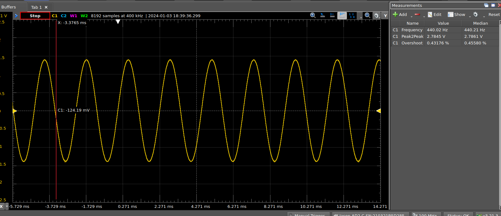
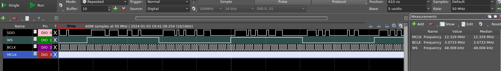

# Audio Project Starter Templates

> <i>Disclaimer: This code has not been stringently tested or gone through any verification process.  It has been used in a number of my blog projects, so it can be considered 'smoke tested'.  

>You're free to use it as you see fit, but you'll have to fix any problems you find; I won't, nor do I need to be told about them, thanks but if there are problems that impact me, I'll fix them, myself, until then I don't care about them. </i>

This repository contains my starter projects for various boards I use for digital synthesiser and effects units.

The starter template only configures board support for audio; other onboard devices are left unconfigured.

Where there is an onboard Audio DAC, it will be used; otherwise, you will need to supply an external Audio DAC and connect it to the I2S peripheral (typically I2S2).

For boards without an Audio DAC, I test with a UDA1334A DAC (no master clock) and a Cirrus CS4344 (with master clock).

All the projects provide the same primary starter set of features:

- I2S configuration.
- DMA circular streaming from memory to I2S peripheral.
- Basic GPIO for onboard LED and BTN.

I prefer to use copies of code for templates rather than build libraries or links to standard shared files.  It all gets very messy otherwise.

Templates are available for the following boards:

- Generic "Blackpill" (STM32F411CEU6)
- STM32F411-Disco (STM32F411VET6)
- (more coming soon)

# CMake
I'm not going to provide endless details on how to build the projects.  They all use CMake generating a build recipe for Ninja.  This choice is a result of my preferred IDE which is Visual Studio Code (VS Code).

| File | Description |
|------|-------------|
| CMakeLists.txt| The project-level CMake definition file|
| source/CMakeLists.txt | Application-level CMake definition file, this has the compiler flags etc|
| cmake/stm_arm_gcc.cmake | STM GCC ARM Toolchain locations and flags | 
| CMakePresets.json| CMake presets for "debug" and "release" |

Run the CMake build command as usual from the command.  There is an option in the top-level CMakeLists.txt to enable flashing the device after a build. 

CMake is configured to look for a specific build toolchain in the <b>cmake/stm_arm_gcc.cmake</b> file.  

I use the STM patched version of the GCC ARM toolchain from the STMCubeCLT (command line tools) package.  You can get this from their website.  You can use other toolchains but will have to change paths in various places.


# VS Code
If you use VS Code then you can open an individual board folder (not the top-level folder) and use the VS Code CMake extension to configure and build the project.  

- Ctrl+P - CMake:Configure
- Ctrl+P - CMake:Build
- Terminal->Run Task->Flash

I've also included various VS Code specific .json files:

| File | Description |
|------|-------------|
|extensions.json| Recommended extensions, this will offer to download if you don't have them. You will need at least the C/C++, Embedded and CMake extensions|
|launch.json| A debugger launch configuration |
|tasks.json| Build and flash tasks |


# STM Low-Level Drivers & CMSIS

The templates use CMSIS and the STM low-level drivers (stm_ll_xxxxx.h).  

I do not use the STM HAL.  The LL drivers, which are stateless,  provide only a thin veneer over CMSIS but provide a little more legibility for understanding the code.

There are places where I've reverted to using CMSIS and registers directly, this is usually where I cannot get the LL drivers to do what I want and don't have the time to figure out how to make them do so.

# Audio Modes
All the templates work the same way, in fact most of the code is common to them all.  

The first setting to be aware of is ```#define SAMPLE_RESOLUTION``` in the audio.h file which can be set to either 16 or 32 bit (actually 24 bit) resolution.  This sets buffer sizes and determines which audio modes you can then select for use.

```C
#define SAMPLE_RESOLUTION 16  
//#define SAMPLE_RESOLUTION 32  

```

The audio modes are a set of enums also defined in audio.h, the available list is limited by the SAMPLE_RESOLUTION mode selected:

```C
/* Supported audio configurations */
typedef enum
{
#if SAMPLE_RESOLUTION == 16	
	I2S_44_16,
	I2S_48_16,
	I2S_44_MCKOE_16,
	I2S_48_MCKOE_16,
#else
	I2S_44_32,
	I2S_48_32,
	I2S_44_MCKOE_32,
	I2S_48_MCKOE_32,
#endif	
} audio_mode_t;
```

Use one of the available enums to configure the audio mode  ```main()```

```C
audio_config_t *pConfig = audio_streaming_run(audio_buffer, I2S_44_MCKOE_16);
```

# The Audio Configs LUT
Rather than calculate the various prescalers each time, I prefer to pre-calculate them and use a lookup-table (LUT).

These are what is read by ```audio_streaming_run()``` according to the mode you supplied.  The LUT contains all the modes supported by the device.

```C

*
 * This is a LUT of the various config items for specific audio modes that we support.
 */
audio_config_t configs[] =
		{
#if SAMPLE_RESOLUTION == 16			
				{.N = 302, .R = 2, .DIV = 53, .ODD = 1, .MCKOE = 0, .bits = 16, .type = I2S_44_16, .fsr = 44100.46875f},
				{.N = 192, .R = 5, .DIV = 12, .ODD = 1, .MCKOE = 0, .bits = 16, .type = I2S_48_16, .fsr = 48000.0f},
				{.N = 290, .R = 2, .DIV = 6, .ODD = 1, .MCKOE = 1, .bits = 16, .type = I2S_44_MCKOE_16, .fsr = 43569.0f},
				{.N = 271, .R = 2, .DIV = 6, .ODD = 0, .MCKOE = 1, .bits = 16, .type = I2S_48_MCKOE_16, .fsr = 47991.07031},
#else
				{.N = 429, .R = 4, .DIV = 19, .ODD = 0, .MCKOE = 0, .bits = 32, .type = I2S_44_32, .fsr = 44099.50781f},
				{.N = 384, .R = 5, .DIV = 12, .ODD = 1, .MCKOE = 0, .bits = 32, .type = I2S_48_32, .fsr = 48000.0f},
				{.N = 290, .R = 2, .DIV = 6, .ODD = 1, .MCKOE = 1, .bits = 32, .type = I2S_44_MCKOE_32, .fsr = 43569.0f},
				{.N = 258, .R = 3, .DIV = 3, .ODD = 1, .MCKOE = 1, .bits = 32, .type = I2S_48_MCKOE_32, .fsr = 47991.07031}
#endif
};
```

These settings should work for most Audio DACs.

Note that the slight inaccuracies in the sample rate are caused by the limitations of scaling the PLL provided by the MCU.  Use the fsr from the table in any audio calculations to ensure that your outputs are correctly tuned.  They are generally accurate to within a fraction of a percent.

# DMA
Data is transferred from Memory to I2S using a circular (continous) DMA mechanism. 

The DMA will signal each time it has cleared half the the audio buffer with an interrupt.  One at half-complete, the other at fully complete.  You need to ensure that the half of the buffer that was just read is refreshed before DMA circles around to read it again.

The example ```main()``` has a loop which shows this approach.  The loop runs continously but looks out for a flag being set by the interrupt which indicates that one or other of the buffer halfs (PING and PONG in this case) need to be filled.  

The template includes a couple of test audio generators (saw and sine approximation) and the example code to fill the buffer.  Essentially you should be able to compile the template and immediately hear a 440Hz tone if all is setup correctly.

While not servicing the interrupt ```main()``` could, of course, be doing other things.

```C

while (1)
{
    if (buf_state != REFILL_DONE)
    {        
        int16_t *ptr =
                buf_state == REFILL_PING ? 
                    audio_buffer : 
                    audio_buffer + AUDIO_BUF_SGL;

        /* refill the buffer pointed to by ptr */
        <snip>

        /* Signal we're done */
        buf_state = REFILL_DONE
    }
    else
    {
        /* No refill required, do other stuff here */
        <snip>
    }
}

```

If you are using an RTOS then you'll likely move this code into a task.  

For most synthesisers I use this bare-metal super-loop approach as, other than MIDI processing, I rarely want the code to be doing anything other than processing audio.  I don't usually have a UI preferring to use MIDI to control all the parameters.

# Thats it.
And that's pretty much all there is to it.  

This my DSO showing a 440Hz sine approximation on the Blackpill via a UDA1334A at 24bit/48 kHz.



